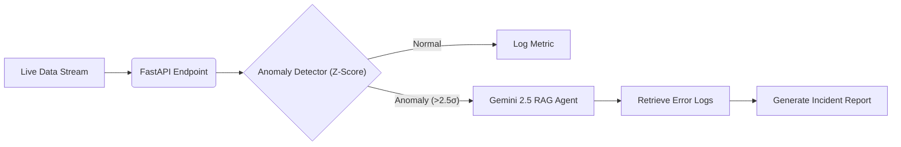

# Sentinel: Autonomous MLOps & Anomaly Agent 🛡️


[](https://sentinel-mlops.onrender.com/docs)

## 📋 Abstract
**Sentinel** is an autonomous MLOps monitoring agent designed to detect data drift and system anomalies in real-time.

Unlike passive dashboards that only show charts, Sentinel acts as an active **"First Responder."** It utilizes statistical signal processing (Z-Score analysis) to flag outliers, then triggers a **Generative AI Agent (Gemini 2.5)** to perform Root Cause Analysis (RCA) via RAG on system logs.

## ⚡ Key Features
| Feature | Tech Stack | Description |
| :--- | :--- | :--- |
| **Drift Detection** | `scikit-learn` / `numpy` | Uses Rolling Statistics and Z-Score thresholds (Physics-based) to detect anomalies in time-series data streams. |
| **Autonomous Investigation** | `Google Gemini 2.5` | Automatically retrieves error logs related to the anomaly and generates a remediation plan. |
| **Microservice Architecture** | `FastAPI` | Deployed as a lightweight REST API, capable of running on Edge/Mobile environments. |
| **Self-Healing Logic** | `Python` | Closes the loop between "Alert" and "Action" without human intervention. |

## ⚙️ System Architecture

1.  **Ingest:** API Endpoint receives live metrics (`cpu_usage`, `memory`, `latency`).
2.  **Detect:** The **Math Engine** calculates standard deviation from the moving average.
3.  **Trigger:** If deviation > 2.5σ, the **AI Agent** wakes up.
4.  **Resolve:** The Agent performs RAG (Retrieval Augmented Generation) on the log knowledge base and outputs a fix.



## 🚀 Installation & Usage

### Prerequisites
*   Python 3.9+
*   Google Gemini API Key

### 1. Clone & Install
```bash
git clone https://github.com/eatosin/Sentinel-MLOps.git
cd Sentinel-MLOps
pip install -r requirements.txt
```

### 2. Configure Environment
Create a `.env` file:
```bash
GEMINI_API_KEY=your_key_here
```

### 3. Run the Microservice
```bash
uvicorn main:app --reload
```
*Server will start at `http://localhost:8000`*

### 4. Simulating an Attack
Send a POST request to `/monitor` with a high CPU value to trigger the AI:
```json
{
  "timestamp": "10:00",
  "service_name": "PaymentGateway",
  "cpu_usage": 900
}
```

**Response:**
> **Status:** CRITICAL
> **Investigation:** "Root Cause: Unauthorized cryptocurrency mining activity (`minerd`) detected. Recommended Fix: Terminate process immediately."

## 🔴 Live Demo
**Don't just read the code—interact with the Agent live.**

I have deployed the full microservice to the cloud. You can test the Anomaly Detection engine and the Gemini RAG Agent directly through the Swagger UI.

👉 **[Access the Live Sentinel API Here](https://sentinel-mlops.onrender.com/docs)**

**How to test it:**
1.  Click the link above.
2.  Click the green **`POST /monitor`** bar.
3.  Click **Try it out**.
4.  Paste the "Attack Simulation" JSON (CPU Usage: 900).
5.  Click **Execute** and watch the Agent generate a Critical Incident Report in real-time.
---

## 👨‍🔬 Author
**Owadokun Tosin Tobi**
*AI Engineer & Physicist*
*   **Specialization:** MLOps, Anomaly Detection, and Autonomous Agents.
```
